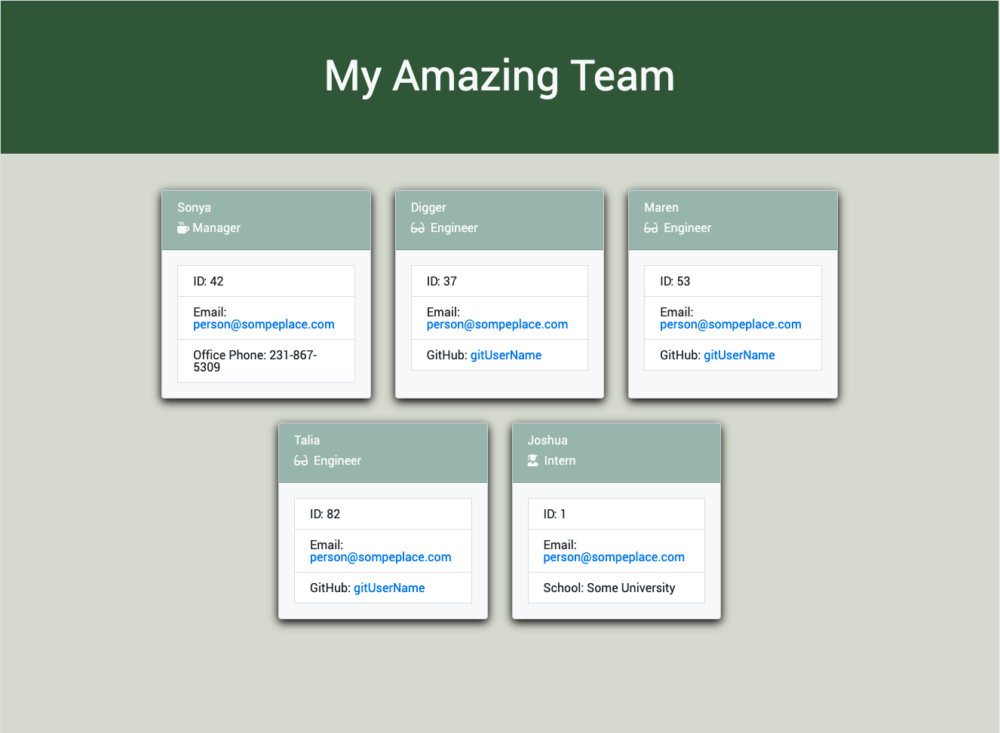

# 10 Object-Oriented Programming

## Creating a Team Profile Generator

This is the tenth assignment for the MSU Coding Bootcamp; create a command-line application that uses the [Inquirer Package] prompts to receive information about a devloper's team members, and then displays the summaries of eacah team member on a rendered HTML page.  

Tests for each module will also be created to ensure the code is functioning as intended.

### Live Links
- [Daniel Shoup's Team Profile Generator Repisitory](https://github.com/danshoup/team-profile-generator)
- [Daniel Shoup's Team Profile Generator Demo Video](https://drive.google.com/file/d/1mDbIgMFZG7CoDk4Q9W_7h0CXW2roblzk/view)
- [Daniel Shoup's link to the sample HTML file:](https://github.com/danshoup/team-profile-generator/blob/main/dist/team.html)

### Team Profile Generator Screenshot

### Acceptance Criteria

- Must include Employee, Manager, Engineer, and Intern classes, and the corresponding tests for these classes must ALL pass.

- Should use Jest for the tests and Inquirer for collecting user input. The app should be invoked by using 'node index.js'.

- Sample HTML file generated using the application must be submitted.

- A link to the GitHub repository containing the application code must be submitted.

- Repository has a unique name, and follows the best practices for file structure, code structure, commit messages, and a high-quality README file that includes a link to the walkthrough video for the application.

